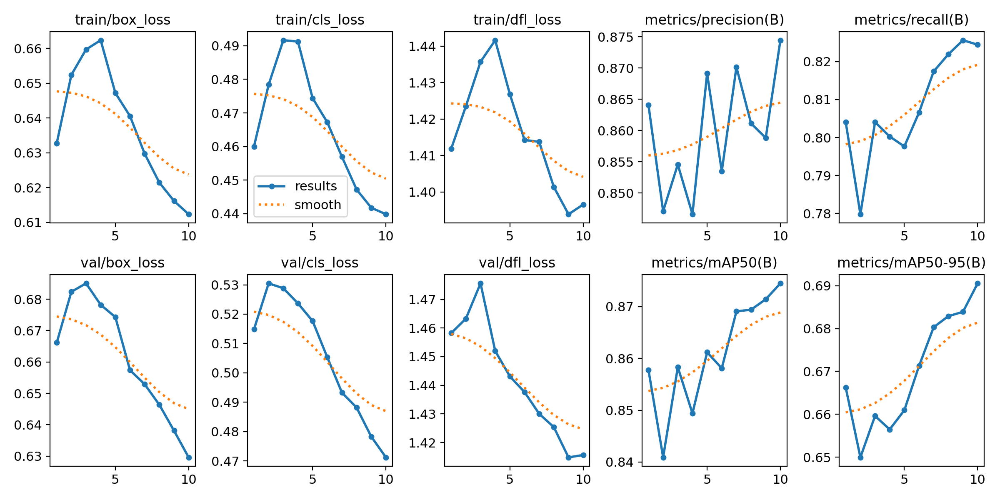
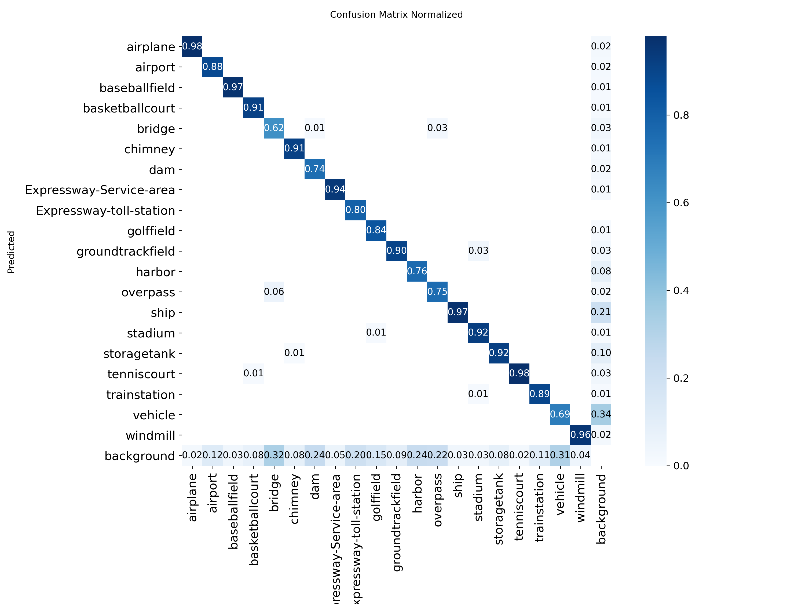

# 🛰️ Advanced Aerial Imagery Object Detection (YOLOv11-OBB)

  

## 📌 Project Overview
This project utilizes **YOLOv11-OBB (Oriented Bounding Box)** to detect objects in high-resolution satellite imagery. Unlike standard detection, this model predicts **rotated bounding boxes**, allowing it to accurately detect diagonal objects like ships, bridges, and vehicles in dense environments.

## 📊 Key Results (Epoch 10)
* **mAP@0.50:** 87.5%
* **Precision:** 87.4%
* **Recall:** 82.5%
* **Validation Loss:** Converged to 0.63

## 🏗️ Architecture
* **Backbone:** CSP-Darknet + SPPF
* **Neck:** PANet + BiFPN (Feature Fusion)
* **Head:** Decoupled OBB Head (Angle Regression)
* **Algorithm:** Oriented Non-Maximum Suppression (ONMS)

## 📂 Dataset Analysis
The model handles severe class imbalance using advanced augmentation:
* **Dominant Class:** Ships (48k+ instances)
* **Rare Class:** Train Stations (~800 instances)

## 📈 Performance Graphs

*Fig 1. Training losses and metrics showing rapid convergence by Epoch 10.*


*Fig 2. Normalized Confusion Matrix showing 97% accuracy on Ships.*

## 🚀 How to Run
1. **Clone the repository:**
   ```bash
   git clone https://github.com/prat181/Satellite-OBB-Detection-YOLOv11.git

## 2. Install dependencies:
pip install -r requirements.txt

## 3. Run Inference:
from ultralytics import YOLO

# Load the trained model
model = YOLO("weights/best.pt")

# Predict on a satellite image
results = model.predict("path/to/your/image.jpg", save=True)
